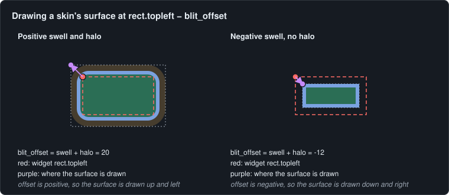
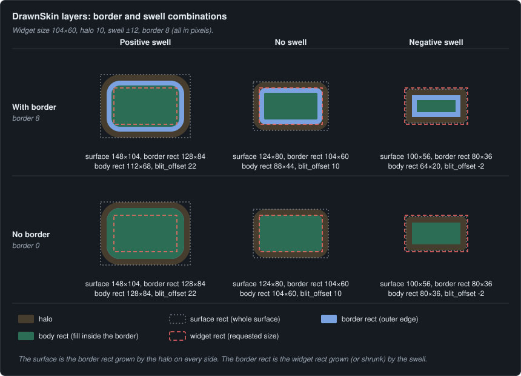
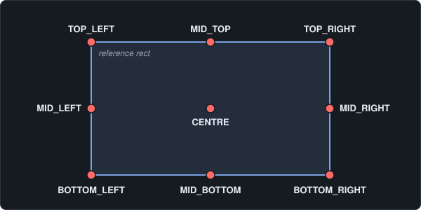
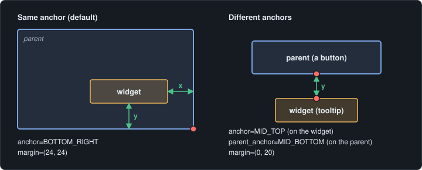
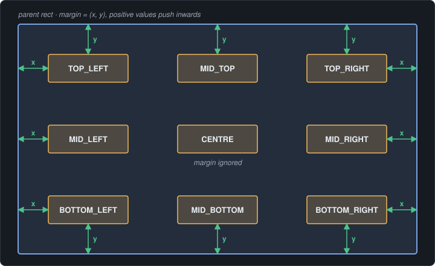
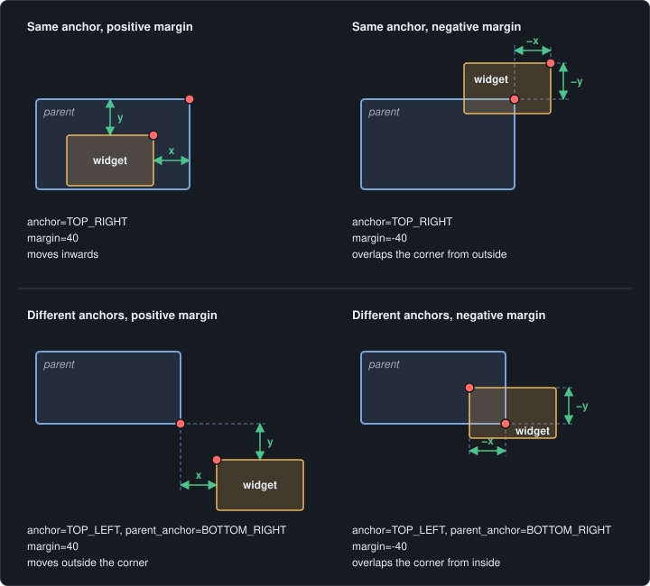
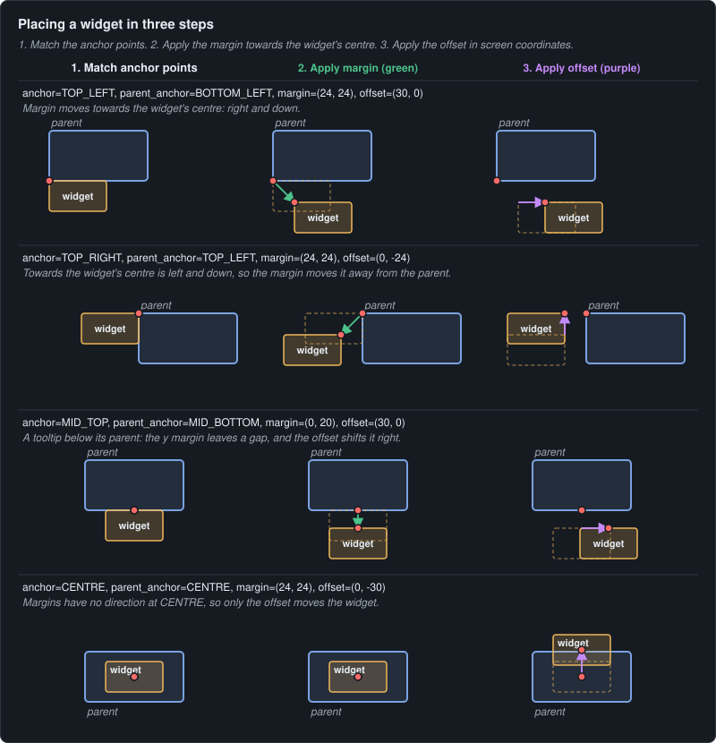

# puigame architecture

This document records the design of puigame v0.1: what the library does, how it is structured, and the decisions behind it. Later pull requests implement it piece by piece; when a decision changes, this document is updated in the same pull request.

All puigame code is written by hand. This document, like the rest of the documentation (including the docstrings in the code), was first drafted with AI assistance and then checked by hand.

## Contents

- [Goals and scope](#goals-and-scope)
- [Integration](#integration)
- [Class hierarchy](#class-hierarchy)
- [Widget tree and flags](#widget-tree-and-flags)
- [Components](#components)
- [Themes](#themes)
- [Anchors](#anchors)
- [State](#state)
- [Rendering and caching](#rendering-and-caching)
- [Drawing: WidgetGroup](#drawing-widgetgroup)
- [Input](#input)
- [Callbacks](#callbacks)
- [Positions and types](#positions-and-types)
- [Assets](#assets)
- [Naming and code conventions](#naming-and-code-conventions)
- [Package layout](#package-layout)
- [v0.1 scope](#v01-scope)
- [Build order](#build-order)
- [Open questions](#open-questions)

## Goals and scope

- **UI widgets for pygame-ce**: widgets, anchoring, skins, themes, event dispatch, and keyboard navigation.
- **Framework-agnostic**: no event bus, scenes, or game loop inside the library. The game owns the window and the loop; puigame receives events, updates, and draws.
- **Passive API plus callbacks**: puigame exposes methods and accepts callables. The game, or a game framework built on top, does the wiring.

Out of scope: event buses, scene management, game key bindings, and game-specific widgets (health bars, minimaps, and so on). These belong in games or in a separate framework package.

## Integration

A game uses puigame through a `UI` object. Each `UI` combines two parts:

- **`ui.root`**: a `UIRoot`, the widget at the top of the UI's tree. It fills the UI's area (the whole screen by default) instead of anchoring to a parent, and can never be given a parent itself. Every widget added to the UI becomes its child, directly or further down the tree.
- **`ui.manager`**: a `UIManager` that runs the UI: input routing, the highlight, press capture, and the cursor (see [Input](#input)).

`UI` passes the common calls through, so a game rarely needs either part directly. `ui.add(widget)` is shorthand for `widget.set_parent(ui.root)`.

```python
ui = puigame.UI()
ui.add(puigame.Button(..., text="Back", on_click=go_back))

while running:
    for event in pygame.event.get():
        if ui.handle_event(event):  # True = consumed by the UI
            continue
        ...  # the game handles everything else
    ui.update(dt)
    screen.fill(BACKGROUND)
    draw_game(screen)
    ui.draw(screen)  # UI drawn on top
```

In an event-bus framework, a scene owns a `UI` like any other manager: the scene subscribes `ui.handle_event` to the bus, calls `ui.update` and `ui.draw` each frame, and passes callbacks that publish to the bus. puigame never imports the framework.

### Layering

A screen that shows several UIs at once, such as a pause menu over a HUD, uses a separate `UI` for each. puigame does not coordinate them; the game decides the order:

```python
for event in pygame.event.get():
    if pause_ui.handle_event(event):  # top layer first
        continue
    if not paused and hud.handle_event(event):
        continue
    ...  # the game handles the rest

hud.draw(screen)
pause_ui.draw(screen)  # drawn last, so on top
```

- **Input** goes to the top UI first and stops at the first one that consumes it. A modal menu is the game not passing events to the UIs below.
- **Drawing** goes from the bottom UI to the top.
- **Each UI has its own highlight and settings**: a HUD typically turns keyboard navigation off, while a pause menu keeps it on.
- **Only one UI should manage the cursor** at a time, since the cursor belongs to the whole window. The others are created with `manage_cursor=False` (see [Cursor](#cursor)).

### Timing

`update(dt)` takes the time since the last frame in **seconds**, as a `float`. puigame measures all durations in seconds (for example a text caret blinking every `0.5` seconds), so the UI runs at the same real-world speed at any frame rate.

`dt` defaults to `DEFAULT_DT = 1 / 60`, which suits games running at a fixed 60 fps. Games running at other or variable frame rates pass the real elapsed time:

```python
dt = clock.tick(fps) / 1000  # Clock.tick() returns milliseconds
ui.update(dt)
```

The default is stated in the `update()` docstring, so it appears in editor tooltips, and in the user documentation.

## Class hierarchy

The hierarchy is shallow and describes **behaviour** only. Appearance (skins) and content (text) are added by composition.

```
Widget                  pygame Sprite: rect, anchor, children, flags, skin, state-surface cache
├── UIRoot              top of a UI's tree: fills the UI's area, never has a parent
├── Container           invisible group of children (no skin)
├── Panel               Container behaviour with a skin, so it has a background
├── Label               + Text component, non-interactive
└── InteractiveWidget   + highlightable, plus the highlight and activation behaviour interactive widgets share
    ├── Button          + press and release, on_click; optional Text
    │   └── Checkbox    + checked, can_untoggle, optional CheckboxGroup
    └── TextBox         + editable Text, editing mode (no PRESSED state)

CheckboxGroup           helper: mutual exclusion between checkboxes (radio behaviour)
WidgetGroup             LayeredUpdates subclass that draws the widget tree
UI                      composes root (a UIRoot) and manager; owns the theme and root group
UIManager               runs one UI: routes input, tracks the highlight and presses, manages the cursor
```

- **`InteractiveWidget` lives in `core`**, so the `UIManager` can find interactive widgets with `isinstance()` without importing from `widgets`. Non-interactive widgets (`Container`, `Panel`, and `Label`) have no highlight concept at all.
- **Every widget can hold children.** The tree lives on `Widget` itself, so any widget can parent another (for example a tooltip that is a child of its button). `Container` and `Panel` are thin classes that exist to make intent clear.
- Complex widgets are built by **composing** simpler ones (a slider is a container holding a track and a handle button), not by deepening the hierarchy.

### Widgets are pygame Sprites

Every widget is a `pygame.sprite.Sprite` with an `image` and a `rect`, so widgets work with sprite groups and fit games that organise objects into groups. pygame's sprite system is part of pygame itself, so this does not tie puigame to any game framework.

## Widget tree and flags

### Parents and children

Every widget stores a reference to its `parent` (or `None`) and an ordered list of its children. `children` is read-only: it returns a tuple, so it cannot be appended to or replaced, and `set_parent()` is the only way to change it.

- A widget added to a `UI` becomes a child of `ui.root`, which covers the UI's area (the whole screen by default). Every widget in a UI therefore has a parent, except the root itself. A widget not yet in any UI has no parent and stays at `(0, 0)`.
- A parent, children, or both can be passed when a widget is created.
- `set_parent()` is the single place where the link changes, so both sides always agree. Passing children on creation calls `set_parent()` on each child.

`set_parent(new_parent)`:

1. Does nothing if `new_parent` is already the parent.
2. Removes this widget from the old parent's children, if there was one.
3. Sets `new_parent` as this widget's parent.
4. Adds this widget to `new_parent`'s children.

Passing `None` detaches the widget from the tree.

`UIRoot` overrides `set_parent()` to raise an error if it is given a parent, since the root always sits at the top of its tree. For other widgets, before changing anything, `set_parent()` raises `ValueError` if `new_parent` is the widget itself or one of its descendants, since either would create a loop in the tree.

### Flags

Each widget has its **own** flags, which parents never overwrite, and a tree-aware version of each:

| Own flag | Taking parents into account |
|---|---|
| `visible` | `visible_in_tree` |
| `enabled` | `enabled_in_tree` |

- The `_in_tree` values are **calculated on demand**, never stored: a widget is visible in the tree only if it and every widget above it are visible (the same for enabled).
- `InteractiveWidget` adds a third pair: `highlightable` (default `True`) and `highlightable_in_tree`, which is true only if the widget's own `highlightable` is true **and** it is `visible_in_tree` and `enabled_in_tree`. Setting `highlightable=False` lets an interactive widget be skipped by highlighting, for example a button that should only respond to the mouse. See [Highlight](#highlight).
- Hiding a parent changes only its own flag; its children's `_in_tree` values change automatically. A child hidden individually stays hidden when its parent is shown again.
- Widgets that are not `visible_in_tree` are not drawn; widgets that are not `enabled_in_tree` ignore input.

## Components

Components are objects a widget **holds** as attributes, rather than classes it inherits from. This avoids multiple inheritance and lets one widget hold several of the same kind (for example a title and a subtitle).

| Component | Held by | Job |
|---|---|---|
| **`Skin`** | Every `Widget` (optional; `None` means transparent) | Renders the widget's background surface for a given size and `State` (see [Skins](#skins)) |
| **`Text`** | Widgets that display text, such as `Label`, `Button`, and `TextBox` (as many as the widget needs; widgets without text hold none) | Holds the string, font, and colour; is positioned within its owner by an anchor and margin; renders onto the owner's image; notifies the owner when it changes |

A `Text` component is **not** a child widget: it is not a Sprite, receives no input, and is drawn into its owner's image rather than on its own.

### Skins

A skin turns a size and a state into a surface, following the rules in the theme. Widgets are given a skin when they are created and do not know which kind they have. One skin can serve many widgets.

`Skin` is an abstract base class: it defines `render(size, state)` and cannot be created itself. Every skin's `render()` returns a `BlitOffsetImage`: a **new** surface, as `image`, so a widget can draw its content onto it without affecting other widgets, together with a **blit offset**, as `blit_offset`.

- Without effects, the surface is exactly the requested size and the offset is `(0, 0)`.
- A halo or a positive swell makes the surface **larger** than the widget, and a negative swell makes it smaller. The offset says how far up and to the left of `rect.topleft` to draw the surface, so the drawing stays centred on the widget's rect.
- The widget's `rect` stays the size it was given, so effects are purely visual: hit-testing ignores the halo.



- **`TransparentSkin`**: a fully transparent surface, the same in every state. For widgets with no background.
- **`DrawnSkin`**: built in code from the theme's style for each state: body and border colours, border thickness, corner radius, halo, and swell. Works with no art at all and draws cleanly at any size. See [DrawnSkin layers](#drawnskin-layers).
- **`ImageSkin`**: one image per state, scaled with **nine-slice** so corners stay crisp at any size. A `pixel_art` option switches to nearest-neighbour scaling to keep hard pixel edges. Accepts a `pygame.Surface` or a path.
- Custom skins subclass `Skin` and implement `render()`.

Scaling behaviour is a per-skin option, not a global setting.

#### DrawnSkin layers

`DrawnSkin` works with four rects, all centred on the same point:

- **Widget rect**: the widget's `rect`, at the size it was given. Layout and hit-testing use this one.
- **Border rect**: the widget's outer edge. It is the widget rect grown by the swell on every side, or shrunk by a negative swell.
- **Body rect**: the fill inside the border. It is the border rect shrunk by the border thickness on every side.
- **Surface rect**: the whole rendered surface. It is the border rect grown by the halo thickness on every side.

It draws three filled, rounded rectangles from largest to smallest: the halo (filling the surface rect), the border (filling the border rect), and the body (filling the body rect). Each layer covers the middle of the one before, so no gaps appear at rounded corners. The style's `corner_radius_px` is the radius of the border rect at the widget's normal size. The halo's radius is larger by the halo thickness and the body's smaller by the border thickness, and all three grow or shrink with the swell, so the layers stay concentric. Each layer's radius is kept between 0 and half that layer's shorter side, as in CSS: a radius that would be larger gives a pill shape, and one that would be negative, such as the body's inside a border thicker than the corner radius, gives square corners.



- A **fading halo** is drawn as one ring per pixel of thickness, from the outermost in. Each ring's alpha follows the style's `FadeProfile`: `SOLID`, `LINEAR`, or a soft or hard quadratic or cubic curve.
- If the swell and border would give the body a **negative** size, `render()` raises `ValueError`, since the values contradict each other. A body of size 0 (a widget that is all border) is allowed.

## Themes

A `Theme` holds the shared rules skins and text read. It is made of two parts:

- **`base_style`**: a `Style`, which holds every value needed to draw a widget: body and border colours, border thickness, corner radius, halo colour, thickness, and fade profile, swell, and text settings.
- **`style_overrides`**: a mapping from state flags to `StyleOverride`s. Each override sets only the fields that state changes and leaves the rest as `None`. Only fields that `StyleOverride` has can change between states; the others, such as the font, stay the same in every state.

`theme.style_for(state)` returns a complete `Style` for any combination of flags. It starts from `base_style` and applies the override for each flag in the state, in the order the mapping holds them, so a later override wins when two set the same field. Skins and text use this one `Style` and do not need to know how the theme is organised.

- Themes are **immutable**: `Theme`, `Style`, and `StyleOverride` are frozen dataclasses, and `style_overrides` is stored as a read-only copy. Cached images therefore never go out of date because a theme changed. A variation is made with `dataclasses.replace()`.
- `State.BASE` cannot be a key in `style_overrides`, because it is part of every state and its override would always apply. Combined flags, such as `State.DISABLED | State.HIGHLIGHTED`, cannot be keys either: a combination of states is styled by applying each flag's override in turn. Both raise `ValueError` when the theme is created.
- Overrides combine best when each state changes its own fields: for example, highlighting changes the border, checking changes the body, and disabling greys out the colours. Overrides that set different fields always combine; where two set the same field, the order of `style_overrides` decides which wins.
- Styles reject values that cannot be drawn: a negative corner radius, border thickness, or halo thickness, or a font size of 0 or less, raises `ValueError` as soon as the `Style` or `StyleOverride` is created. A negative swell is allowed, since it shrinks the widget. Whether a negative swell leaves room for the body depends on the widget's size, so `DrawnSkin` checks that when it renders.
- The theme lives on the **`UI`**, so every widget in it draws consistently.
- puigame ships a default theme, `DEFAULT_THEME`. It is sized for a **640×360** render surface scaled up with `pg.SCALED`, which suits pixel-art games, and uses pygame-ce's built-in font until a bundled font is added.
- **Later:** the `UI` could assign individual widgets, or whole subtrees, a different theme from its default.

## Anchors

Positions are set with a nine-point `Anchor` (`CENTRE`, `TOP_LEFT`, `TOP_RIGHT`, `BOTTOM_LEFT`, `BOTTOM_RIGHT`, `MID_LEFT`, `MID_RIGHT`, `MID_TOP`, `MID_BOTTOM`) plus a margin.

- A widget is anchored relative to its **parent's rect**; moving or resizing the parent repositions its children. Widgets added directly to a `UI` are anchored to `ui.root`, which covers the UI's area (the whole screen by default).
- A `Text` component is anchored relative to its **owner widget's rect**.

### Anchor points

Each anchor names a point on a rect:



### Matching anchors

Placement aligns a point on the widget with a point on its parent:

- `anchor`: the point **on the widget**.
- `parent_anchor`: the point **on the parent**. Optional; defaults to the same as `anchor`.

With the same anchor on both, the widget sits **inside** its parent (for example, bottom-right corner to bottom-right corner). With different anchors, it can sit **outside** or alongside it (for example, a tooltip that is a child of a button, with its `MID_TOP` matched to the button's `MID_BOTTOM`, sits directly below the button whatever either widget's size).



### Margins

`margin` is either a single number or an `(x, y)` pair. A single number `m` is shorthand for `(m, m)`.

The margin's direction comes from the **widget's own anchor**: a positive margin moves the widget from its anchor point towards its own centre, and a negative margin moves it the other way. The parent's anchor plays no part in the direction.

Margins therefore never use pygame's screen-coordinate signs (`+x` right, `+y` down). The same positive value means "towards the widget's centre" at every anchor, so changing anchors never requires flipping signs. [Offset](#offset) is the one value that does use screen coordinates.

With the same anchor on the widget and its parent, a positive margin moves the widget inwards:



| Anchor | Margin used |
|---|---|
| Corners (`TOP_LEFT`, `TOP_RIGHT`, `BOTTOM_LEFT`, `BOTTOM_RIGHT`) | `x` horizontally and `y` vertically, both towards the widget's centre |
| `MID_LEFT`, `MID_RIGHT` | `x` only |
| `MID_TOP`, `MID_BOTTOM` | `y` only |
| `CENTRE` | Ignored |

Examples:

- `anchor=BOTTOM_RIGHT, margin=10` places the widget 10 px left of and 10 px above its parent's bottom-right corner.
- `anchor=TOP_LEFT, margin=(20, 8)` places it 20 px in from the left and 8 px down from the top.
- `anchor=MID_TOP, parent_anchor=MID_BOTTOM, margin=(0, 4)` places it directly below its parent with a 4 px gap.
- `anchor=TOP_RIGHT, margin=-8` moves the widget 8 px up and 8 px right of its parent's top-right corner, so it overlaps the corner, like a notification badge.
- `anchor=TOP_LEFT, parent_anchor=BOTTOM_RIGHT, margin=4` places the widget just outside its parent's bottom-right corner, with a 4 px gap. Here a positive margin moves the widget away from its parent, because the direction comes from the widget's own anchor.
- With the same anchors, `margin=-8` moves the widget's top-left corner 8 px back inside its parent's corner, so it overlaps the corner from inside.



In short: a positive margin always creates space between the matched points, and a negative margin moves them past each other. Whether that space is inside or outside the parent depends on the anchors, not on the sign.

### Placement in three steps

Every placement follows the same three steps:

1. **Match the anchor points**: move the widget so its `anchor` point sits on its parent's `parent_anchor` point.
2. **Apply the margin**: move the widget by the margin, in the direction from its own anchor point towards its own centre. The parent's anchor plays no part.
3. **Apply the offset**: move the widget by the offset, in screen coordinates.

For example, with `anchor=TOP_LEFT` and `parent_anchor=BOTTOM_LEFT`, step 1 hangs the widget below its parent's bottom-left corner. Its centre is to the right of and below its top-left corner, so a positive margin moves it right and down: further below the parent, but also inwards from the parent's left edge.



### Absolute placement

`widget.place_at_pos((x, y))` places the widget's top-left corner at `(x, y)` relative to its parent's top-left corner (screen coordinates, for a widget added directly to a full-screen `UI`). It is shorthand that sets `anchor` and `parent_anchor` to `TOP_LEFT` and `margin` to `(x, y)`, not a separate positioning system: layout still runs as normal, and changing the parent's position moves the widget with it. A single number raises `TypeError`, since a position needs both coordinates; the check happens before anything changes, so a rejected call leaves the widget as it was.

### Offset

`offset` is an optional `(x, y)` nudge in **screen coordinates** (pygame's convention: `+x` is right, `+y` is down), applied after the anchor and margin. It works on every anchor, including centred axes, where margins have no inward direction:

- `anchor=CENTRE, offset=(0, -20)` places a widget 20 px above the centre of its parent.
- `anchor=MID_BOTTOM, margin=12, offset=(20, 0)` places it 12 px up from the bottom edge, then 20 px right of centre.

The two parameters keep one meaning each: `margin` is space relative to the anchors, `offset` is a plain screen-space shift.

`margin` accepts a single number as shorthand for both axes, but `offset` requires an `(x, y)` pair: a single number raises `TypeError`, since an equal shift on both axes is a diagonal move and rarely intended.

Both are stored as `pygame.Vector2`, whatever form they are given in, so layout can use them in calculations directly. They are properties: assigning a new value converts it, while changing the stored vector in place (for example `widget.offset.y -= 2` to animate a slide) works as expected.

## State

A widget's state is a `State`, an `enum.Flag`. It is derived from the widget's flags and from interaction, so it describes behaviour as well as appearance, and it selects the widget's cached surface (see [Rendering and caching](#rendering-and-caching)):

```python
class State(Flag):
    BASE = 0
    DISABLED = auto()
    HIGHLIGHTED = auto()
    PRESSED = auto()
    CHECKED = auto()
    EDITING = auto()
```

| Member | Meaning |
|---|---|
| `BASE` | No flags set: the widget's ordinary state |
| `DISABLED` | The widget is not `enabled_in_tree`: it ignores input and draws its disabled look |
| `HIGHLIGHTED` | The mouse is over the widget, or keyboard navigation has selected it (see [Highlight](#highlight)). Pressing adds `PRESSED` on top |
| `PRESSED` | A press, by mouse button or by Enter or Space, is in progress on the widget |
| `CHECKED` | A `Checkbox` is checked |
| `EDITING` | A `TextBox` is receiving typed text |

Each member is one bit, so a combination such as `State.HIGHLIGHTED | State.PRESSED` is a single `State` value. Combinations are hashable and are used directly as cache keys. `BASE` has no bits set: it is the empty combination.

### Current state

`current_state` is a property built by composing flags with `|=`. Each class adds its own flags on top of its parent's:

- `Widget` starts from `BASE` and adds `DISABLED` when not `enabled_in_tree`.
- `InteractiveWidget` calls `super().current_state` and, unless `DISABLED` is set, adds `HIGHLIGHTED`.
- `Button` adds `PRESSED`, again only when not `DISABLED`.
- `Checkbox` adds `CHECKED` when `checked` is true.
- `TextBox` adds `EDITING`.

`DISABLED` suppresses `HIGHLIGHTED` and `PRESSED`: a disabled widget never looks interactive.

### Valid states

Not every combination can occur, so each class lists the combinations it can be in **explicitly**, in a class-level `possible_states` tuple, annotated as a `ClassVar`. The cache renders exactly these.

| Class | `possible_states` |
|---|---|
| `Widget`, `Container`, `Panel`, `Label` | `BASE`, `DISABLED` |
| `Button` | `BASE`, `HIGHLIGHTED`, `HIGHLIGHTED \| PRESSED`, `DISABLED` |
| `Checkbox` | Button's four, each with and without `CHECKED` (eight) |
| `TextBox` | `BASE`, `HIGHLIGHTED`, `HIGHLIGHTED \| EDITING`, `DISABLED` |

## Rendering and caching

Each widget builds its image in layers:

1. The skin renders the widget's background for a state, returning the image and its blit offset as a `BlitOffsetImage`.
2. Content (`Text` components, check marks, and so on) is drawn on top. Content is positioned relative to the widget's rect, so the blit offset is added to its position to land it on the body rather than in a halo margin.
3. The result is stored in the widget's cache, a `dict[State, BlitOffsetImage]`. The image and its offset are kept together, since they are made together and drawing needs both.

Caching rules:

- **Per widget, per state**: one surface for every combination in the class's [`possible_states`](#valid-states).
- **Eager**: all states are rendered when the widget is created. Lazy rendering (on first use) is a later optimisation.
- **State changes swap `image`** from the cache, with no drawing. Each frame, `update()` reads `current_state` and looks up its surface, so `image` always matches the widget's flags and its parents' flags.
- **Invalidation**: the cache is cleared and rebuilt whenever text, size, skin, or theme changes. These values are changed only through setters, which handle the rebuild.

Because rendering happens at creation, widgets must be created after `pygame.init()`. Converting surfaces for display (`convert_alpha()`) also requires a display window to exist.

## Drawing: WidgetGroup

`WidgetGroup` subclasses pygame's `LayeredUpdates`:

- **Layers follow the tree**: children draw above their parents. Layers are corrected when widgets are added, moved in the tree, or reordered, so layering can change while the game runs.
- **Hidden widgets are skipped**: widgets that are not `visible_in_tree` are not drawn.

The `UI` owns the root `WidgetGroup`. Games that keep their own sprite groups can still add widgets to them, since widgets are ordinary sprites.

## Input

```
pygame event → ui.handle_event → UIManager
   ├─ mouse    → hit-test topmost first → the first widget that handles it stops it
   ├─ keyboard → the editing TextBox, or highlight navigation and activation
   └─ unused   → returns False → the game handles it
```

### Hit-testing

Widgets are hit-tested against their `rect` by default. A widget can opt into a **mask** (built from its current image) so that non-rectangular widgets, such as round buttons, respond only where they are drawn.

### Highlight

Mouse hover and keyboard focus are **one concept**, the highlight, shown with `HIGHLIGHTED`. A widget is highlighted when the mouse is over it or keyboard navigation has selected it, before any press. The `UIManager` tracks a single highlighted widget.

- **Mouse**: moving the mouse highlights the topmost `highlightable_in_tree` widget under the cursor. Moving onto empty space clears the highlight.
- **Keyboard**: Tab and the arrow keys move the highlight between `highlightable_in_tree` widgets. The `UIManager` switches to keyboard mode and hides the cursor.
- **Switching back**: in keyboard mode, hover is ignored, because the hidden cursor still has a position. The first real mouse movement switches back to mouse mode, shows the cursor, and highlights whatever is under it.
- **Turning keyboard navigation off**: a scene that uses the keyboard for something else (typically a game screen, as opposed to a menu or options screen) creates its `UI` with `keyboard_navigation=False`. Tab, the arrow keys, Enter, and Space then pass through to the game, and only the mouse highlights and activates widgets. A `TextBox` being edited still receives typing.

### Pressing

- **Clicks fire on release**, and only if the cursor is over the widget on release.
- Pressing shows `HIGHLIGHTED | PRESSED`. Dragging off while held shows `BASE`; dragging back on while still held returns to `HIGHLIGHTED | PRESSED`. The widget remembers that the press started on it.
- A press that starts elsewhere and is dragged onto a widget does not press or activate it.
- **Keyboard activation** follows the same rule: Enter or Space down on the highlighted widget shows `HIGHLIGHTED | PRESSED`, and key up fires.
- **Mouse-button enable map**: each button chooses which mouse buttons (left, middle, right, scroll) it responds to.

### Editing text

- Clicking a `TextBox`, or pressing Enter while it is highlighted, starts editing. The text at that moment is kept so editing can be cancelled.
- While editing, the `TextBox` **keeps the highlight** regardless of mouse movement, and the arrow keys move the text caret instead of the highlight.
- **Enter** confirms the text. **Escape** cancels and restores the original text.
- **Clicking elsewhere** ends editing and keeps the text. That click does nothing else.

### Cursor

The `UIManager` hides and shows the mouse cursor as the input mode changes. A game that manages the cursor itself creates its `UI` with `manage_cursor=False`. When several UIs are shown at once (see [Layering](#layering)), only one should manage the cursor. Since `pygame.mouse.set_visible` affects the whole window, this is an option rather than something puigame always does.

## Callbacks

Callbacks are plain callables passed to widgets and receive the widget as their first argument, so one handler can serve several widgets. The exact names and signatures for `Button`, `Checkbox`, `CheckboxGroup`, and `TextBox` are still open (see [Open questions](#open-questions)).

## Positions and types

- **`pygame.Rect` internally**, for pixel-exact positioning.
- Constructors take a **size**, not a position or rect. Position always comes from layout (parent, anchors, margin, and offset), so a widget sits at `(0, 0)` until it has a parent, for example by being added to a `UI`. Absolute placement uses [`place_at_pos()`](#absolute-placement).
- Smooth movement, if needed, keeps a precise `pygame.Vector2` and rounds it into the `Rect`.
- pygame types use pygame-ce's `pygame.typing` aliases. puigame defines its own `Protocol` classes only for its own concepts.

## Assets

- Bundled assets live in `assets/images/` (default skin art, nine-slice-ready) and `assets/fonts/`, all MIT-compatible.
- They are loaded with `importlib.resources`, so they are found wherever the package is installed.
- Fonts are cached, since rendering text is the most expensive step.
- Loading failures raise exceptions (for example `FileNotFoundError`) and never exit the program.
- Game-side concerns stay in games: asset folder conventions, resource paths, and PyInstaller handling. Games bundled with PyInstaller need puigame's data files included in their build.

## Naming and code conventions

- **State flags** are adjectives: `visible`, `enabled`, `highlightable`, `checked`; `State` members likewise (`HIGHLIGHTED`, `PRESSED`, `EDITING`).
- **Tree-aware values** end in `_in_tree`: `visible_in_tree`, `enabled_in_tree`, `highlightable_in_tree`. They are calculated on demand, never stored.
- **Permissions** start with `can_`: `can_untoggle`.
- **Possession** starts with `has_`: `has_text`, `has_children`.
- **Methods** are verbs: `show()`, `hide()`, `toggle()`, `set_text()`.
- **Classes** use `CapWords` with capitalised acronyms (`UIManager`); public names avoid abbreviations, except where they follow pygame's own names (`pos`, as in `event.pos` and `mouse.get_pos()`); English spelling is used (`CENTRE`, `colour`).
- **Docstrings and documentation** use English spelling and the Oxford comma in lists of three or more.
- **Modules** are named after their main class in `lowercase_with_underscores`: `UIManager` lives in `ui_manager.py`, `WidgetGroup` in `widget_group.py`.
- **Error messages** start lowercase, name the exact parameter or field, and have no final full stop. Requirements use "must" and prohibitions use "cannot" (never "must not", which is easy to misread). The bad value follows ", got": `"border_thickness_px cannot be negative, got -2 px"`. Several values are written `name=value` with no spaces around `=`, units are separated by a space (`2 px`), and a second clause follows a semicolon. When a message is split across several string literals, each break comes after a space, so the space ends one line and the next line starts with a word.
- **Exhaustive `match` statements** over an enum end with `case _: assert_never(value)`, so Pyright reports any member that is not handled.
- **`None` checks** use `is None` and `is not None`, never truthiness (`x or default`), so valid falsy values such as `0` or `""` are never replaced by a default. Optional arguments default to `None`, never to a mutable object such as a list, and the real default is created inside the function.

## Package layout

```
src/puigame/
├── assets/
│   ├── fonts/
│   └── images/
├── components/                objects widgets hold
│   ├── __init__.py
│   ├── skin.py                Skin, DrawnSkin, ImageSkin (nine-slice)
│   └── text.py                Text and the font cache
├── core/
│   ├── __init__.py
│   ├── anchor.py              Anchor
│   ├── interactive_widget.py  InteractiveWidget
│   ├── state.py               State
│   ├── ui.py                  UI
│   ├── ui_manager.py          UIManager
│   ├── ui_root.py             UIRoot
│   ├── widget.py              Widget, DEFAULT_DT
│   └── widget_group.py        WidgetGroup
├── themes/
│   ├── __init__.py
│   └── theme.py               Theme and the default theme
├── widgets/
│   ├── __init__.py
│   ├── button.py
│   ├── checkbox.py            Checkbox and CheckboxGroup
│   ├── container.py
│   ├── label.py
│   ├── panel.py
│   └── textbox.py
├── __init__.py                public API re-exports
└── py.typed
```

The tree follows VS Code's Explorer order with `explorer.sortOrderLexicographicOptions` set to `unicode`: folders first, then files, sorted by character code (so `ui.py` comes before `ui_manager.py`). Tests mirror this layout under `tests/`.

### Dependencies

Each layer imports only from the layers above it:

1. `core/anchor`, `core/state`
2. `themes/theme`
3. `components/skin`, `components/text`
4. `core/widget`
5. `core/interactive_widget`, `core/ui_root`, `core/widget_group`
6. `widgets/*`
7. `core/ui_manager`
8. `core/ui`

`UIManager` and `UI` need only `Widget`, `InteractiveWidget`, `UIRoot`, and `WidgetGroup`, not the concrete widgets, so nothing in `core` imports from `widgets`. This prevents circular imports and makes it clear where new code belongs.

## v0.1 scope

**Classes:** `Anchor`, `State`, `Widget`, `InteractiveWidget`, `UIRoot`, `WidgetGroup`, `UIManager`, `UI`, `Theme` with a default theme, `Text`, `DrawnSkin`, `ImageSkin` with default art, `Container`, `Panel`, `Label`, `Button`, `Checkbox` with `CheckboxGroup`, and `TextBox`.

**Features:**

- The widget tree, with `set_parent()` and the `_in_tree` flags
- Layout every frame from anchors, margin, and offset, plus `place_at_pos()`
- Eager per-state surface caching
- A single highlight shared by mouse and keyboard, with keyboard navigation that can be turned off
- Press-and-release activation with mouse capture, and a mouse-button enable map
- Text editing in `TextBox`
- Cursor management, with an opt-out
- Optional mask hit-testing
- Bundled default art and fonts, loaded with `importlib.resources`

**Later:** lazy caching, per-widget themes assigned through the `UI`, an `Image` widget, sliders and progress bars (as compound widgets), dropdowns, scroll and list views, row and column layouts, a shared skin cache, and a non-linear (eased) halo fade.

## Build order

Each step is one branch and pull request, with tests:

1. `docs/architecture`: this document
2. `chore/package-structure`: subpackages, `__init__.py` files, and module stubs
3. `feat/widget-base`: `Anchor`, `State`, the abstract `Skin` with `TransparentSkin`, and a first pass at `Widget`, with the tree, flags, and state cache (replaces the `hello()` placeholder)
4. `feat/theme-drawn-skin`: `Theme` and `DrawnSkin`
5. `feat/text`: `Text` component and font cache
6. `feat/layout`: positioning from anchors, margin, and offset, plus `place_at_pos()`
7. `feat/widget-group`: `WidgetGroup`
8. `feat/container-panel-label`: `Container`, `Panel`, and `Label`
9. `feat/ui`: `InteractiveWidget`, `UIRoot`, `UIManager`, and `UI`: the root widget, input routing, highlight, keyboard mode, and cursor management
10. `feat/button`: `Button`
11. `feat/checkbox`: `Checkbox` and `CheckboxGroup`
12. `feat/textbox`: `TextBox`
13. `feat/image-skin`: `ImageSkin`, nine-slice scaling, pixel-art option, and default art

## Open questions

- **Callbacks**: names and signatures for each widget, whether programmatic changes (for example `checkbox.checked = True`) notify, and whether Escape on a `TextBox` has its own callback.
- **Combining style overrides**: overrides are currently absolute, so when two active states set the same field the later one in `style_overrides` wins, and combined keys such as `State.DISABLED | State.HIGHLIGHTED` are rejected. Possible next steps, decided once a real widget needs them (most likely `Checkbox`):
  - **Relative overrides**: colour fields that multiply the value underneath (a tint, or a lighten or darken factor) as well as replacing it, so effects such as hover and checked combine on the same field. Integer fields would add, and enum fields such as `halo_fade_profile` would still replace. `StyleOverride` would need a way to mark each value as absolute or relative.
  - **Two passes**: apply absolute values first, so the most specific wins, then relative values on top. Multiplication gives the same result in any order, so relative values would no longer depend on dict order.
  - **Combined keys**: allowed only if stacking and relative overrides cannot express a look. Overrides would apply in order of specificity (fewer flags first, then dict order), worked out once when the theme is created and stored privately, so `style_overrides` stays as given. A relative value in a combined key is an extra adjustment for the combination; an absolute value replaces whatever came before.
  - **Where it lives**: change `Theme` itself if the new rules replace the old ones; use a subclass, or a strategy object the theme holds, only if both sets of rules are needed side by side.
